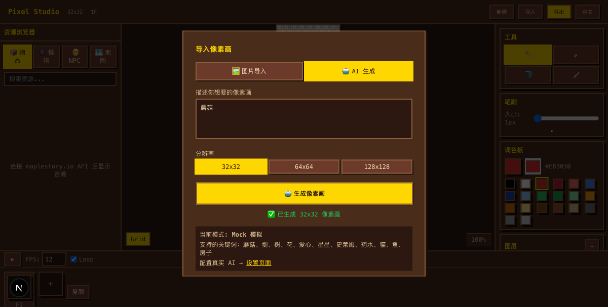
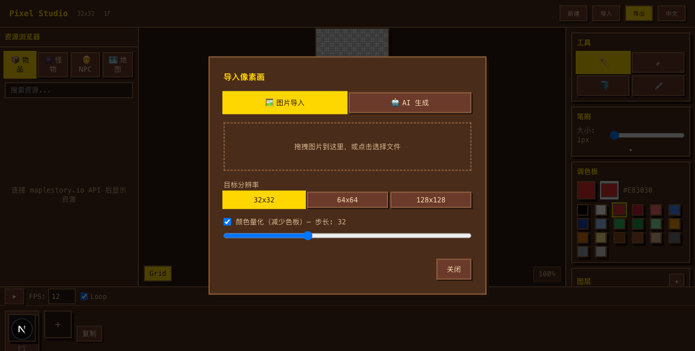
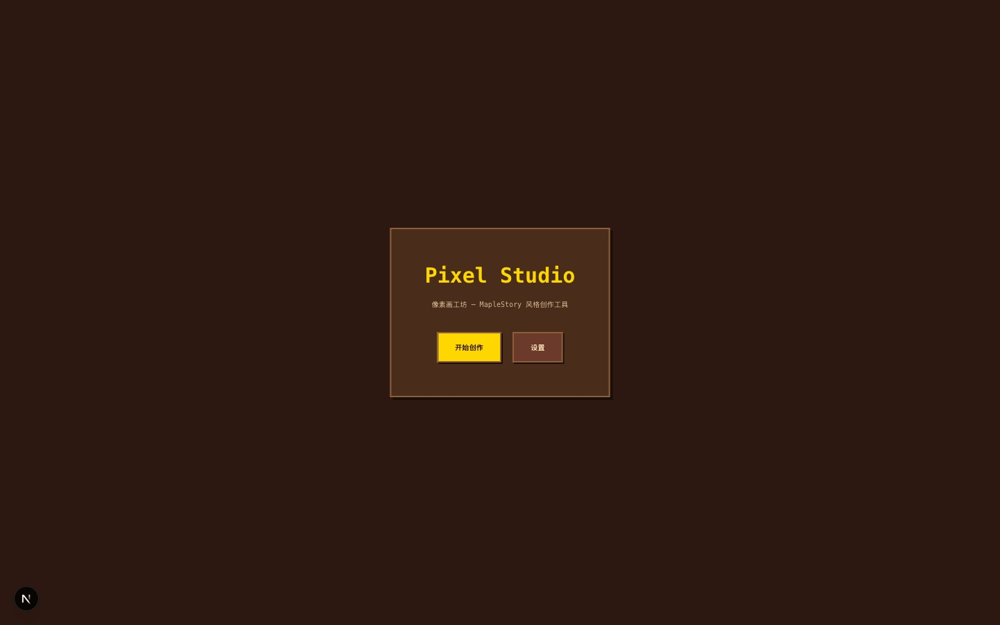
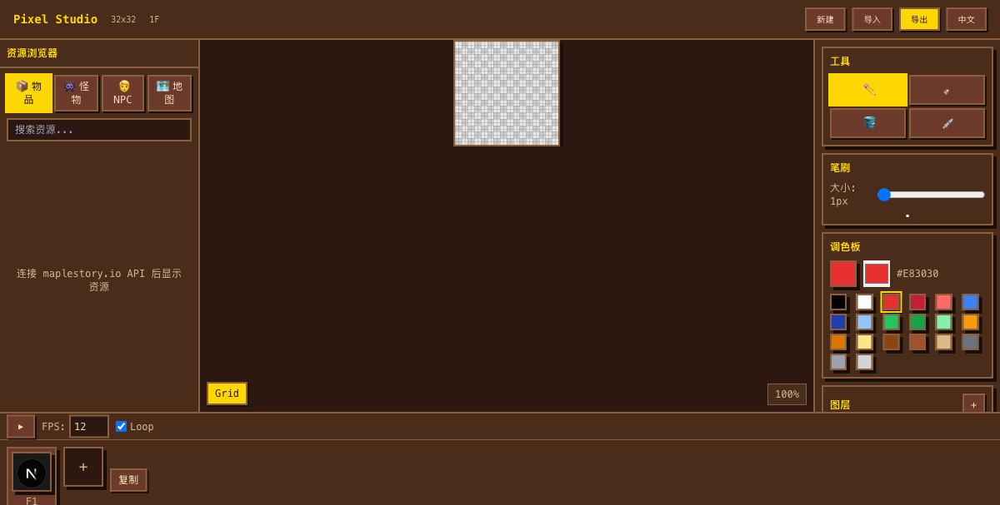

# 🍄 Maple Pixel — 像素画工坊

一个受 **冒险岛（MapleStory）** 像素风格启发的像素画创作工具。支持多图层编辑、帧动画、图片导入、AI 文字生成像素画。



## ✨ 已实现功能

### 🎨 画布编辑
- **像素画布** — Canvas 2D 高性能渲染，支持 32x32 ~ 512x512 自定义分辨率
- **绘图工具** — 铅笔、橡皮擦、油漆桶（BFS 填充）、取色器
- **笔刷大小** — 1-16px 可调
- **冒险岛经典调色板** — 20 色预设 + 自定义颜色选择器
- **网格叠加** — 可开关的像素网格参考线
- **缩放控制** — 鼠标滚轮缩放（0.5x ~ 32x），实时显示缩放百分比
- **撤销/重做** — Command Pattern，最多 50 条历史记录

### 📑 多图层系统
- **图层管理** — 新建、删除、重命名图层
- **图层控制** — 显示/隐藏、锁定/解锁、透明度调节
- **每帧独立图层** — 不同帧可有不同的图层像素数据

### 🎬 帧动画时间轴
- **帧管理** — 添加、删除、复制帧
- **帧缩略图** — 实时预览每一帧的画面
- **播放控制** — 播放/暂停、FPS 调节（1-60）、循环播放
- **洋葱皮** — 支持显示前后帧的半透明预览

### 📥 导入功能
- **图片转像素画** — 拖拽或上传图片，自动降采样到目标分辨率
- **颜色量化** — 可选的颜色量化处理（减少色板，更像素风）
- **AI 文字生成** — 输入文字描述自动生成像素画
  - Mock 模式：10+ 种冒险岛风格图案（蘑菇、剑、树、花、爱心、星星、史莱姆等）
  - 真实 AI API：支持 OpenAI (GPT)、Anthropic (Claude)、通义千问 (DashScope)

### 🖼️ 资源浏览器
- **分类浏览** — 物品 / 怪物 / NPC / 地图 四个分类
- **搜索过滤** — 按名称或 ID 搜索
- **maplestory.io API** — 连接冒险岛资源 API，自动获取图标

### 📤 导出
- **PNG** — 导出当前帧为 PNG 图片
- **GIF** — 导出全部帧为 GIF 动画
- **Sprite Sheet** — 所有帧拼合为精灵表（水平排列）

### 🌐 界面与主题
- **中英双语** — 一键切换中文 / English
- **冒险岛复古像素风主题** — 深棕色背景、金色高亮、像素风边框阴影
- **像素字体** — Press Start 2P 字体渲染
- **自定义滚动条** — 像素风滚动条样式

---

## 🚧 未实现功能

- **选区工具** — 矩形/套索选区，支持移动、复制、翻转选区内容
- **直线绘制** — Bresenham 算法画直线
- **曲线/椭圆工具** — 像素几何形状绘制
- **平铺/对称绘制** — 镜像对称、中心对称等对称模式
- **帧动画洋葱皮** — UI 已完成但实际半透明预览逻辑待完善
- **项目保存/加载** — IndexedDB 本地存储像素画工程
- **Sprite Sheet 导入** — 从 Sprite Sheet 反向拆帧

---

## 💡 可以改进的功能

- **maplestory.io API 集成** — 当前 API 数据端点返回 404，恢复后可自动显示冒险岛真实图标。可考虑使用其他冒险岛 CDN 源作为备用
- **Canvas 性能** — 大画布（256x256+）可引入 OffscreenCanvas + Web Worker 加速渲染
- **AI 生成质量** — Mock 模式是硬编码图案模板，接入真实 AI API 后可生成任意图案。可优化 prompt engineering 提高 JSON 输出稳定性
- **快捷键系统** — 目前仅 Ctrl+Z/Y，可扩展 B（铅笔）、E（橡皮）、F（填充）、I（取色）、G（网格开关）等
- **i18n 全覆盖** — 当前核心界面已有中英双语，导入弹窗和设置页的新增功能文案可以补全翻译
- **响应式布局** — 目前固定三栏布局，移动端可改为可折叠面板
- **图层混合模式** — 正片叠底、叠加、滤色等 PSD 风格混合模式
- **自定义色板** — 保存用户常用颜色为预设色板，支持导入/导出色板
- **撤销历史可视化** — 时间线形式的历史缩略图预览
- **Electron 桌面端** — 基于同一套 Canvas 引擎打包为桌面应用

---

## 🚀 快速开始

```bash
# 安装依赖
npm install

# 启动开发服务器
npm run dev

# 生产构建
npm run build
npm start
```

打开 [http://localhost:3000](http://localhost:3000) 开始使用。

## 🏗️ 技术栈

| 层 | 技术 |
|---|------|
| 框架 | Next.js 15 (App Router) |
| 语言 | TypeScript |
| 渲染 | HTML Canvas 2D |
| 状态管理 | Zustand |
| 数据获取 | SWR |
| 样式 | Tailwind CSS + CSS Variables |
| GIF 导出 | gifenc |

## 📁 项目结构

```
├── app/                          # Next.js App Router 页面
│   ├── layout.tsx
│   ├── page.tsx                  # 首页
│   ├── canvas/page.tsx           # 画布工作区
│   └── settings/page.tsx         # 设置页
├── components/
│   ├── canvas/                   # 像素画布渲染
│   ├── header/                   # 顶部导航
│   ├── sidebar-left/             # 左侧资源浏览器
│   ├── sidebar-right/            # 右侧工具面板
│   ├── timeline/                 # 底部时间轴
│   └── modals/                   # 弹窗（新建/导入/导出）
├── lib/
│   ├── canvas/                   # Canvas 引擎 + 工具 + 导出
│   ├── store/pixel-store.ts      # Zustand 状态管理
│   └── i18n/                     # 中英翻译
└── docs/                         # 设计文档和实现计划
```

---

## 📸 截图

### 首页


### 画布工作区


### 图片导入


### AI 生成


### 设置页

